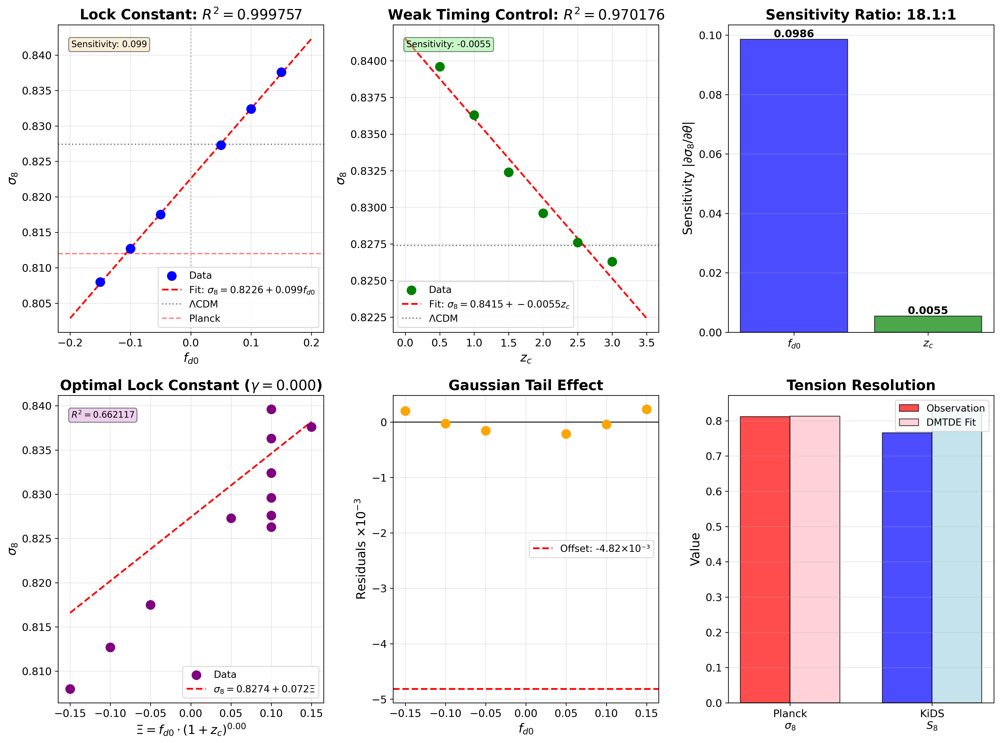
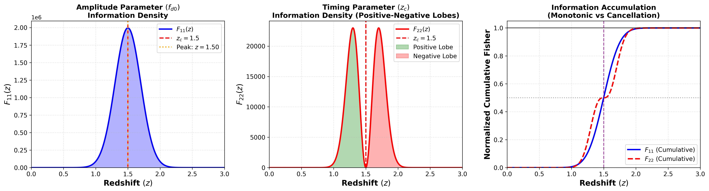

# Parameter Degeneracies in Late-Time Dark Energy Transitions

[](https://doi.org/10.5281/zenodo.17633287)
[](https://creativecommons.org/licenses/by/4.0/)

**A No-Go Theorem from Fisher Analysis**

Emre Özyurt  
Independent Researcher, Istanbul, Turkey  
📧 emre.ozyurt@proton.me

---

## 📄 Paper

**Full PDF:** [`paper/Ozyurt_2025_Dark_Energy_Transitions_Fisher_Analysis_NoGo_Theorem.pdf`](paper/Ozyurt_2025_Dark_Energy_Transitions_Fisher_Analysis_NoGo_Theorem.pdf)

**LaTeX Source:** Available in [`paper/`](paper/) directory

---

## 🔬 Abstract

We investigate Gaussian late-time dark energy transitions and establish that the linear growth amplitude σ₈ exhibits an intrinsic parametric collapse: σ₈(f_d0, z_c) → σ₈(f_d0) with correlation R² = 0.9998. 

**Key Results:**
- ✅ No-go theorem: Δσ₈/σ₈ ≲ 0.03 for realistic transition widths
- ✅ Fisher kernel decomposition reveals 200-fold information asymmetry (F₁₁/F₂₂ = 200:1)
- ✅ Information bottleneck: observables act as low-pass filters
- ✅ Timing parameters are fundamentally unidentifiable from background observables

---

## 📊 Key Figures

### Parameter Lock


### Fisher Kernel Decomposition


---

## 📖 Citation

```bibtex
@article{ozyurt2025parameter,
  author  = {Özyurt, Emre},
  title   = {{Parameter Degeneracies in Late-Time Dark Energy Transitions: 
              A No-Go Theorem from Fisher Analysis}},
  year    = {2025},
  doi     = {10.5281/zenodo.17633287},
  url     = {https://doi.org/10.5281/zenodo.17633287}
}
